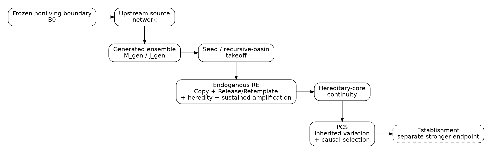
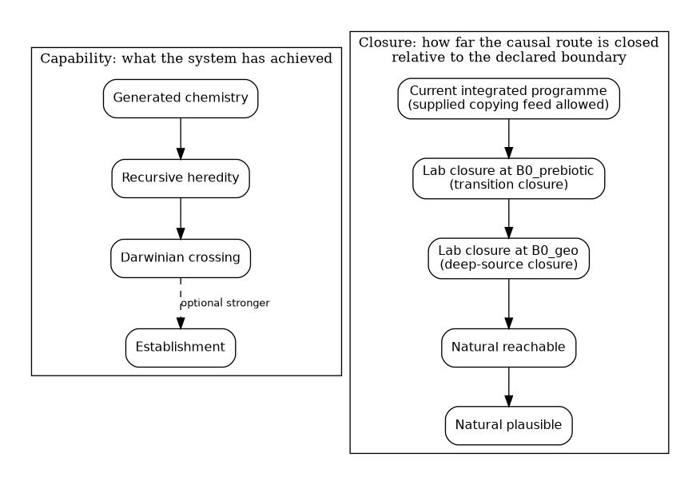
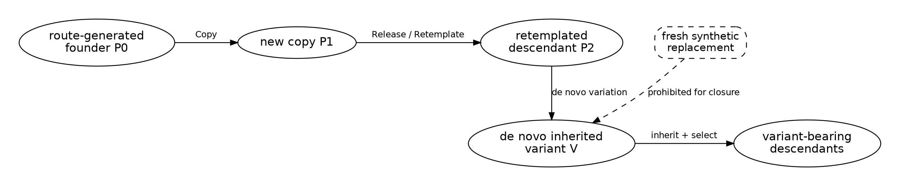
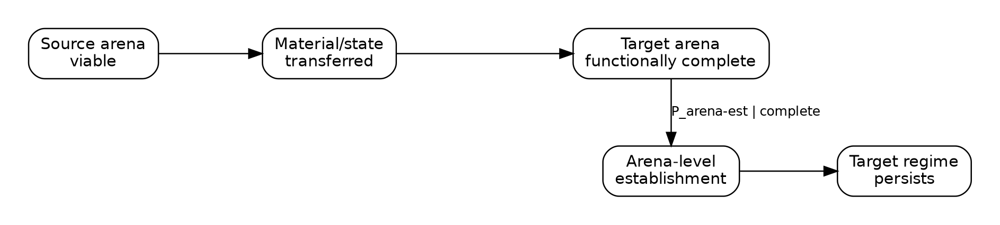
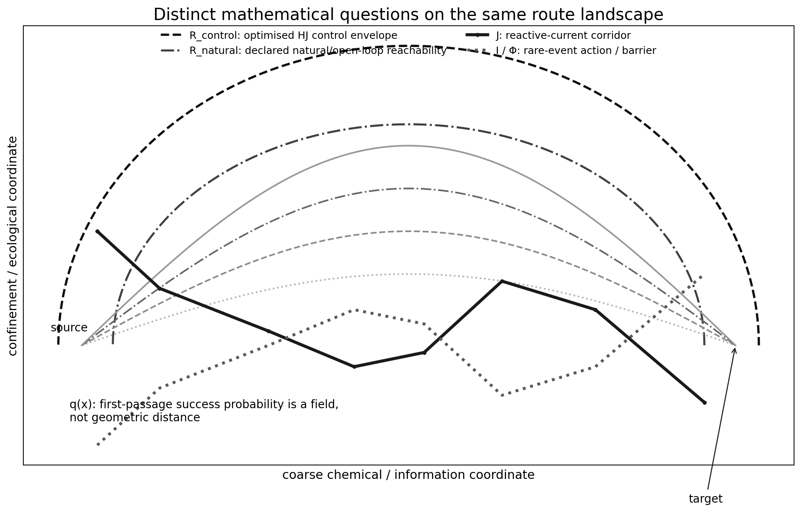
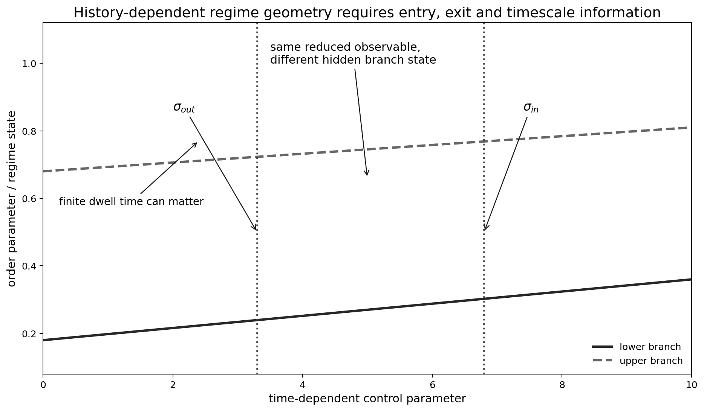
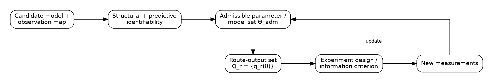
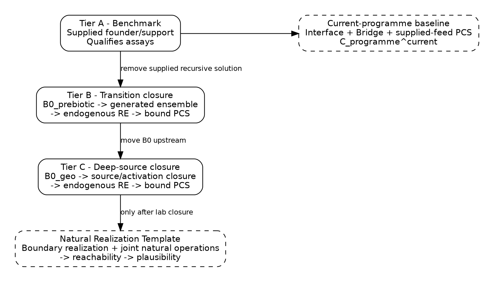

Marcus Hermansson

25 September 2026 \| Manuscript 3.2.0 \| Kernel 2.7.7

# Abstract

Origin-of-life research contains strong demonstrations of many isolated prebiotic functions, but successful reactions do not automatically compose into a continuous route from nonliving chemistry to Darwinian evolution. The Minimal Viable Spark (MVS) framework treats abiogenesis as a **physically constrained first-passage and route-closure problem** on a spatially structured, nonequilibrium and potentially history-dependent state space. The central object is a typed route whose material, energetic, temporal and hereditary continuity can be tested rather than inferred from a list of individually plausible modules.

Three generated-state objects are kept distinct: the normalized source-conditioned polymer distribution $\mu_{gen}^{\Theta}$, the absolute production-flux measure $J_{gen}^{\Theta}$, and, where local cooperative emergence matters, the joint generated-configuration measure $\mathcal{M}_{gen}^{\Theta}$. These objects describe what the chemistry generates; they do not by themselves establish life. A route-generated founder or cooperative set must enter a preregistered recursive basin before loss, demonstrate new Copy, physical Release/Retemplate, generation-resolved heredity and sustained recursive amplification, and do so without a preloaded target solution. Only descendants of that **same hereditary core** can then be credited with the operational Darwinian crossing (PCS). The minimal claim-bearing spine is

$$\left( \mu_{gen},J_{gen},\mathcal{M}_{gen} \right) \rightarrow G_{seed} \rightarrow G_{RE}^{endo} \rightarrow G_{RE \rightarrow PCS} \rightarrow D_{PCS}^{local}.$$

with post-PCS lineage establishment treated as a distinct stronger problem.

The framework also separates discovery from confirmation. Adaptive development may identify useful regimes, but a claim-bearing route is a frozen causal object: the starting boundary, route specification, forcing and continuation policy, permitted conditioning, pooling rules and primary thresholds are fixed before confirmatory execution. Clean-feed benchmarks and synthetic reconstructions diagnose mechanisms and matrix effects; only the **actual upstream output** can close a claim-bearing handoff.

Trace A provides a worked RNA-like instantiation without making RNA, cyclic phosphate, wet-dry cycling or vesicles universal requirements. It back-chains from generated polymer ensembles through cyclic-phosphate ligation and a short RNA self-reproduction benchmark to nucleoside activation and upstream source chemistry. The companion laboratory master protocol defines Experiment A as Transition-Core Validation: a frozen nonliving activated-feed boundary is used to test generated-polymer production, endogenous recursive heredity and same-core Darwinian crossing without importing a recursive solution. Experiment B is the Full Route-Closure Experiment: the starting boundary is moved upstream into declared geochemical source chemistry, and a physically joined actual-output F0-B6 route must pass integrated qualification and full-route freeze before confirmatory execution. The framework therefore specifies what an integrated laboratory demonstration must establish while keeping laboratory closure, natural reachability and historical inference as separate claims.

**Keywords:** origin of life; abiogenesis; nonequilibrium chemistry; generated ensemble; Replicator Emergence; recursive heredity; Darwinian crossing; route closure; transition path theory; protocells; experimental preregistration; lineage establishment

**Figure 1. Causal spine.** A route-closure claim starts at a frozen nonliving boundary, passes through a physically generated ensemble and endogenous Replicator Emergence, binds the same hereditary core into PCS, and treats establishment as a distinct stronger endpoint.

# 1. Introduction: the missing object is the route

The origin of life is not one reaction. It is a causal sequence in which matter and energy are processed through changing physical environments until a system that did not previously possess recursive heredity begins to reproduce hereditary state, generate inherited variation and undergo differential reproductive success. Hydrothermal, metabolism-first, RNA-first, protocell, wet-dry, freeze-thaw and systems-chemistry traditions each illuminate parts of that process. The integration problem is whether the relevant parts can be connected under mutually compatible conditions and whether the material that succeeds downstream is physically descended from the material generated upstream.

Suppose mechanisms $A$, $B$ and $C$ have each been demonstrated. It does not follow that

$$A \rightarrow B \rightarrow C.$$

At least four distinct failures are possible. First, **condition incompatibility**: the state leaving $A$ may not survive the conditions required by $B$. Second, **material discontinuity**: $A$ may generate a broad product class while $B$ is actually run with a purified, activated or composition-normalized substitute that $A$ never produced. Third, **ancestry discontinuity**: endogenous recursive heredity can succeed in one experiment while a different supplied hereditary system succeeds in the Darwinian-selection experiment. Fourth, **adaptive route substitution**: an experiment can begin on route $r$ but be chemically rescued after inspection, such that the successful history no longer corresponds to the preregistered route. Individually successful modules cannot be composed into a closed origin route by assumption.

The relevant object is therefore a route family in path space,

$$\Gamma_{r} \subset \Omega_{path},$$

plus a frozen confirmatory route specification, the realized physical execution history and provenance that determine whether the claim-bearing downstream lineage is causally connected to the upstream chemistry. A machine-readable implementation of the claim algebra and evidence semantics accompanies the framework, while the companion laboratory master protocol instantiates one candidate route. These implementation artifacts operationalize the definitions given here; they do not substitute for the scientific argument.

The paper asks, for each declared route: Is it physically admissible? Can its ordered requirements be completed under a declared forcing class? What generated molecular distribution does the chemistry actually sample, at what absolute flux and in what local configurations? Can a route-generated founder enter a recursive basin before degradation or dilution? Do newly synthesized descendants become later templates? Does recursive amplification exceed loss? Does the same hereditary core cross the operational Darwinian boundary? If it does, can the resulting population establish? And how much of this can the evidence resolve without conflating physical truth with experimental determination?

The central empirical question can therefore be stated without committing to one historical chemistry:

Can a frozen nonliving chemical system, under a frozen non-adaptive physical forcing programme and without a supplied recursive solution, generate a hereditary system that recursively reproduces, generates inherited variation, and undergoes causal Darwinian selection?

A positive laboratory answer would establish one closed laboratory route under the declared boundary and forcing. It would not prove that early Earth used that route.

# 2. Claim boundary: what exactly has originated?

Origin-of-life language is easily overpromoted, so the framework uses a strict hierarchy.

**Generation** means that the declared chemistry physically produces a distribution of polymers or cooperative polymer/cofactor configurations. Generation can be reproducible while containing no recursive founder.

**Copy** means template-dependent production of a new sequence-bearing product. One copy is not recursive heredity.

**Release/Retemplate** means a newly synthesized descendant is physically released or separated sufficiently to act as a template in a later generation. Thus

$$P_{0} \rightarrow P_{1}$$

does not establish

$$P_{0} \rightarrow P_{1} \rightarrow P_{2}.$$

**Recursive heredity** requires parent-descendant state dependence across generations plus sustained recursive production relative to measured loss. A transient burst that ultimately decays to zero is not sustained Replicator Emergence (RE).

**Operational Darwinian crossing (PCS)** requires a hereditary carrier or physically coherent lineage, new Copy, Release/Retemplate, heredity, a de novo inherited variant and causal differential success attached to that same inherited state. In the formal claim registry this is

$$D_{PCS}^{local} = G_{P} \land G_{C} \land G_{R} \land G_{H} \land G_{V} \land G_{S}.$$

**Lineage establishment** is downstream. A system can cross PCS and nevertheless be subcritical or go extinct:

$$D_{PCS} \Rightarrow \not{}D_{established}.$$

**Carrier individuation** is also stronger than the universal crossing. A validated surface, pore or distributed lineage may satisfy PCS without already being a membrane-bounded reproducer:

$$D_{PCS} \Rightarrow \not{}D_{individuated}.$$

DNA-like stabilization, translation-like systems, metabolic autonomy and catalytic autonomy are likewise stronger capabilities, not definitions of the first Darwinian crossing.

# 3. Two distinct but related dimensions: capability and route closure

The framework separates two different questions: what a system can do, and how much of its causal origin has been closed relative to a declared boundary. They are distinct but formally related rather than statistically or logically independent, because a closure proof contains capability predicates such as endogenous RE and PCS.

## 3.1 Capability axis

The core universal capability progression is

$$\text{generated chemistry} \rightarrow \text{endogenous recursive heredity} \rightarrow \text{Darwinian crossing}.$$

Lineage establishment is a distinct optional stronger downstream tier, not part of the minimal crossing. A route may acquire other optional stronger capabilities in different orders. Compartment individuation, phase organization, primitive metabolism, genotype-phenotype linkage, catalytic autonomy and DNA-like genome stabilization therefore form a lattice around the core ancestry spine rather than one universal ladder.

## 3.2 Closure axis

The framework distinguishes four principal closure levels:

$$C_{programme}^{current},$$

an integrated programme in which Interface, a measured bridge/handoff and PCS can be physically linked even when critical copying feed remains externally supplied;

$$C_{closed}^{lab,r}\left( B_{0} \right),$$

a laboratory RouteProof structurally binding a **declared frozen boundary** $B_{0}$, successful endogenous Replicator Emergence, successful PCS, hereditary-core continuity, sourcing, forcing, energy closure, compatibility, physical admissibility and declared causal coverage. The same closure operator may therefore be evaluated at a prebiotic boundary (transition closure) or at a deeper geochemical boundary (deep-source closure);

$$C_{closed}^{natural - reachable,r},$$

a stronger NaturalProof showing that a declared natural boundary and jointly realizable natural operations have positive support for the route; and

$$C_{closed}^{natural - plausible,r},$$

which additionally requires a preregistered, model-appropriate non-negligibility criterion.

A supplied-feed PCS experiment may therefore be high on the capability axis while remaining open on the closure axis. Conversely, an upstream geochemical network can be well sourced without yet producing recursive heredity. Keeping these axes separate prevents local biological capability from being promoted into a geochemically closed origin claim.

**Figure 2. Capability and closure answer distinct but related questions.** Capability records what the system has achieved; lineage establishment is a distinct optional stronger downstream capability, while closure records how far the causal route has been closed relative to a declared starting boundary. A supplied-feed system may have strong downstream capability while remaining open upstream.

# 4. Route specification, realized history, provenance and evidence

For a declared route

$$Route_{r} = \left( V_{r},E_{r} \right),$$

$V_{r}$ contains physical arenas and capability modules and $E_{r}$ contains physical handoffs or transformations. Five objects must remain separate.

1.  **Route specification:** what operations, boundaries and transitions are permitted.

2.  **Frozen confirmatory route version:** the digest-bound specification actually subjected to a claim-bearing test.

3.  **Realized physical history:** what actually occurred in the experiment or modelled world.

4.  **Provenance and ancestry:** where claim-bearing material and hereditary cores came from.

5.  **Evidence:** what observations resolve about that physical history.

The distinction between physical truth and evidential result is explicit:

$$Truth(C,W) \in \{\top,\bot\},$$

$$Result(C,E) \in \{ PASS,FAIL,NA\}.$$

Certificate status is a separate axis: a physical result can be FAIL with a valid evidential certificate, whereas unresolved evidence can be NA with an incomplete certificate. Incomplete provenance, insufficient temporal resolution or unresolved ancestry cannot be silently treated as a pass or as physical falsification. The full claim ASTs, witness types, registry runtime and evidence semantics are delegated to the technical supplement and accompanying machine-readable formal implementation.

## 4.1 Discovery, route freeze and confirmation

Abiogenesis experiments need discovery, but discovery and confirmation are not the same causal object. During development an investigator may tune concentrations, geometry, assay timing, conditioning operators or model choices. Before a claim-bearing confirmatory run, however, freeze at minimum

$$\mathfrak{F}_{r} = \left( route\_ spec\_ digest,boundary\_ spec\_ digest,B_{0},Ops_{r},\Theta_{r}(t),\pi_{continue},\pi_{select/pool},T_{primary} \right),$$

where $Ops_{r}$ records allowed causal operations, $\Theta_{r}(t)$ the forcing programme, $\pi_{continue}$ the continuation rule, $\pi_{select/pool}$ any permitted selection/pooling rule, and $T_{primary}$ the primary decision thresholds. The exact implementation is encoded in the machine-readable formal implementation and laboratory protocol rather than inferred from narrative.

A post-unblinding change that affects chemistry, candidate survival, selection, rescue, purification or material ancestry creates a **new route version** and requires new confirmation. A preregistered change in observation density that is demonstrably causally inert may be allowed if it is logged as observation rather than intervention. This distinction blocks an otherwise subtle form of adaptive overfitting: finding a promising state and then changing the route until it survives.

## 4.2 Benchmark, reconstruction and actual-output evidence

For a handoff from module $i$ to module $j$, three lanes have different evidentiary roles:

$$\text{clean benchmark} \rightarrow \text{synthetic reconstruction of the upstream mixture} \rightarrow \text{actual upstream output}.$$

The benchmark establishes that the downstream mechanism and assay can work. Synthetic reconstruction diagnoses matrix effects under controlled composition. **Only the actual upstream output** can close the claim-bearing edge $i \rightarrow j$ for the route. If reconstruction passes and actual output fails, the route has exposed a real compatibility problem rather than an invitation to replace the failed material.

# 5. Physical and chemical admissibility comes before route geometry

A visually attractive reaction graph is not an origin route. Every candidate trajectory is first masked by a physical-admissibility gate

$$G_{phys}^{(r)} = G_{mass}G_{charge}G_{thermo}G_{power}G_{phase}G_{bounds}.$$

All factors must pass for the corresponding state/transition to be admitted into $\mathcal{A}_{phys}$.

**Mass and charge.** Stoichiometric accounting must conserve the relevant elements and charge, including counterions and interfacial charge separation where applicable.

**Thermodynamics.** For reaction $j$,

$$\Delta_{r}G_{j} = \Delta_{r}G_{j}^{\circ} + RT\ln Q_{j}.$$

Local detailed balance and cycle consistency must be checked where the kinetic model assumes reversible elementary reactions. The open-CRN formulation also distinguishes dissipation within the stochastic chemistry from the work/dissipation required to maintain or drive environmental chemostats \[22\]. Thus “the environment supplies energy” is not a free boundary condition; the environmental drive has a thermodynamic cost.

**Power/electron budget.** Persistent nonequilibrium chemistry requires sufficient throughput to pay productive and dissipative costs. Experimental origin-of-life models provide concrete examples of such environmental energy coupling, including hydrogen-dependent mineral chemistry \[1\], mineral-membrane pyrophosphate production under pH gradients \[2\] and acetyl-phosphate-centered energy-currency proposals \[15\]. These examples motivate explicit energy accounting but are not universal requirements of the framework. When electrical current is used for chemical bookkeeping, only **Faradaic** charge can be attributed stoichiometrically to redox chemistry:

$$Q_{F}(t) = \int_{0}^{t}I_{F}(\tau)\, d\tau,$$

and

$$n_{e,chem} = Q_{F}/F.$$

When a defensible Faradaic efficiency is measured, use $Q_{F} = \int_{0}^{t}\eta_{F}(\tau)I(\tau)d\tau$. If only total current is available and $\eta_{F}$ is unknown,

$$n_{e,chem} \leq F^{- 1}\int_{0}^{t}\left| I(\tau) \right|\, d\tau,$$

which is a loose upper bound, not a chemical attribution. Capacitive and other non-Faradaic currents can otherwise make a naive $Q/F$ construction overstate the redox budget.

**Phase/speciation.** Solubility, adsorption, precipitation, pH-dependent speciation, gas availability, membrane phase, salinity, metal toxicity and water activity can remove large regions that would otherwise appear kinetically attractive.

**Growth thermodynamics.** Open-CRN work shows that indefinite concentration growth depends on network topology and the way matter is supplied \[21\]. That result must not be confused with biological reproduction. Reactor accumulation, chemical amplification, compartment division and lineage reproduction are separate variables in the formalism.

## 5.1 PAC, CAC and compatibility

Kosc et al. formalize minimal stoichiometric autocatalytic structures as Potential Autocatalytic Cores (PACs) \[3\]. For a restricted stoichiometric matrix $M_{C}$, a flow vector $v$ is an autocatalytic witness if

$$M_{C}v > 0$$

componentwise. PAC existence is topological/stoichiometric. It does not show that the motif runs at environmentally plausible activities.

Building on Kosc et al.’s thermodynamic realizability analysis \[3\], MVS calls a PAC that is realizable under the declared mass-action/thermodynamic constraints a **Consistent Autocatalytic Core (CAC)**. For candidate core $a$ and environmental state $Y$ define

$$\mathcal{C}_{a}(Y) = \{ c \in \mathcal{C}_{env}(Y):c\ \text{realizes core}\ a\}.$$

MVS can assign a robustness diagnostic only relative to a declared reference measure,

$$\rho_{CAC}^{\left( \mu_{ref} \right)}\left( a|Y \right) = \mu_{ref}\left( C_{a}(Y) \right)/\mu_{ref}\left( C_{env}(Y) \right).$$

This quantity is **measure-dependent**. Linear-concentration volume, log-concentration volume and a physically motivated environmental prior generally disagree. It is therefore not coordinate-free until $\mu_{ref}$ is specified.

Multiple individually feasible PAC/CAC modules can also be incompatible when required to share one environment. The relevant network object is a multiCAC compatibility structure rather than a count of isolated autocatalytic cycles.

## 5.2 CRN topology beyond autocatalysis

CRN deficiency adds a different constraint. In the stochastic mass-action setting studied by Marehalli Srinivas et al., deficiency controls whether the dual steady-state-current dynamics remains a mass-action chemical process \[20\]. Driven catalytic networks in their construction have positive deficiency. The framework uses this as a stochastic kinetic-structure diagnostic, not as a universal macroscopic arrow-of-time theorem. Conservation laws, siphons, boundary accessibility and other CRN invariants likewise belong upstream of route-probability calculations.

# 6. Capability space is a lattice, with a mandatory ancestry spine

The MVS state space is not a universal ladder in which every route must acquire the same optional capability in the same physical arena. Mineral surfaces, pores, droplets, condensates and vesicles can support different functions; phase organization, compartment individuation and catalytic autonomy may arise before or after the operational Darwinian threshold.

What is mandatory for a **closed origin claim** is not one arena order but one causal ancestry spine:

$$Generation \rightarrow G_{RE}^{endo} \rightarrow G_{RE \rightarrow PCS} \rightarrow D_{PCS}^{local}.$$

This requirement is weaker than demanding a modern-looking cell and stronger than accepting disconnected modular demonstrations. It permits a surface or pore lineage to cross PCS directly if it satisfies the hereditary-carrier requirements there. A surface-to-vesicle handoff is instantiated only when the declared route actually requires one.

# 7. Constrained polymer production: chemistry samples a generated ensemble

Three generated-state objects must be kept distinct. Let

$$\mu_{gen}^{\Theta}(dp,t)$$

be the **normalized** source-conditioned distribution of newly generated polymer states $p$ under condition $\Theta$. Let

$$J_{gen}^{\Theta}(dp,t)$$

be the corresponding **unnormalized absolute production-flux measure**. For cooperative hypotheses define the joint local generated-configuration measure

$$\mathcal{M}_{gen}^{\Theta}(d\zeta,x,t),$$

where $\zeta$ can record co-localized polymer/cofactor populations, copy numbers or concentrations, stoichiometric relations, terminal activation state, arena or phase context and other variables required by the recursive map. In implementation/runtime notation this third object is Mu_gen.

A route state may therefore carry, schematically,

$$P_{gen} = \left( \mu_{poly},\mu_{gen},J_{gen},\mathcal{M}_{gen},L,seq,struct,activation,age,provenance,local\ context \right).$$

These are **state and measurement objects, not independent origin-of-life claims**. A large oligomer yield or a positive functional screen does not establish $G_{seed}$, endogenous RE or PCS.

The physically relevant question is not whether an abstract sequence exists somewhere in $\left| \mathcal{A} \right|^{L}$ space. It is whether the route produces the required state at measurable absolute flux, in the correct local configuration and before degradation, washout or transport removes it. Functional generated flux can be written schematically as

$$J_{func}(\Theta,t) = \int_{V_{active}^{r}}^{}J_{gen}^{\Theta}(dp,t),$$

but even

$$\mu_{gen}\left( V_{active} \right) > 0$$

does not imply Replicator Emergence. A generated molecule can be catalytically interesting yet fail to recurse.

This distinction also prevents a common probability error. Total molecule count, total wells and repeated cycles do not automatically equal independent founder opportunities. If a founder-opportunity process is later modelled, the effective local intensity and correlation structure must be justified before a Poisson or Cox-process conversion is licensed.

Experimentally only assay-resolved estimates ${\widehat{\mu}}_{gen}$, ${\widehat{J}}_{gen}$ or ${\widehat{M}}_{gen}$ are available. Coverage, censoring, LOD/LOQ, recovery and structural ambiguity belong to the receipt. An undetected sequence class is not automatically absent; unresolved sequence space remains censored/unknown. Likewise, **endpoint abundance is not** $J_{gen}$ unless formation and loss have been separated or bounded by a valid kinetic analysis.

Recent work reinforces why this generated measure should not be assumed uniform. Wet-dry cycling can drive nucleic-acid polymer formation over broad length distributions \[14\]; phase-separated oligomer systems can bias sequence distributions under nonequilibrium fragmentation \[6\]; and spatial autocatalytic systems can preserve local coexistence that disappears in well-mixed models \[4\]. These results motivate measuring the generated ensemble and local configuration rather than replacing them with combinatorial sequence-space priors.

# 8. Replicator Emergence: from a generated ensemble to endogenous recursive heredity

Replicator Emergence (RE) is the claim-bearing transition from generated chemistry to recursive heredity.

## 8.1 Frozen admission boundary

For route $r$, define a frozen boundary

$$B_{0}^{r} = \left( M_{0}^{r},E_{0}^{r},\theta_{0}^{r} \right),$$

containing admitted material, environmental forcing and declared operation policy. The boundary is claim-relative. Admitting a generic buffer, mineral or physical cycle does not by itself make a target capability exogenous; admitting an evolved replicase, full-length recursive founder or indispensable helper that already embodies the claimed capability does.

The boundary may not be moved downstream after the result is observed. A changed boundary defines a different experiment and a different closure claim.

## 8.2 Benchmark versus endogenous RE

The benchmark predicate $G_{RE}^{bench}$ is intentionally permissive enough to validate the apparatus using supplied recursive machinery. It asks whether the system exhibits cooperative completeness, Copy, Release/Retemplate, heredity and sustained recursive amplification.

Endogenous RE adds the founder and support requirements:

$$RE_{endo} = G_{seed} \land G_{F} \land G_{support,endo} \land G_{no\ preloaded\ solution} \land G_{coop\ complete} \land G_{C}^{RE} \land G_{R}^{RE} \land G_{H}^{RE} \land G_{Arep}.$$

This is the distinction that supplied-template origin experiments cannot erase by changing wording.

## 8.3 Sufficient support families

One-at-a-time reagent deletion can misclassify redundant external support. If external catalyst $X_{1}$ or $X_{2}$ can independently rescue a generated founder, deleting either one alone may leave the system functional. Endogenous RE therefore requires at least one **complete sufficient support family** whose claim-bearing support is admissible under the frozen boundary. Transitive provenance prevents external capability from being laundered through an intermediate material.

## 8.4 Recursive basin and seed/takeoff

Let $B_{RE}^{\Theta}$ denote the recursive basin: states from which the declared recursive map has adequate probability or growth support to continue under the frozen condition. A generated founder passes $G_{seed}$ only if it is physically produced, available at adequate local abundance/flux, survives long enough and actually enters the recursive basin before loss.

Thus overlap of $\mu_{gen}$ with a functional proxy set is supporting evidence, not the seed event itself.

## 8.5 Copy, Release/Retemplate and heredity

RE requires a direct chain such as

$$P_{0} \rightarrow P_{1} \rightarrow P_{2},$$

where $P_{1}$ is newly synthesized and becomes a later template. Parent-descendant dependence must survive founder-exclusion and carry-over tests. Fresh-template rescue is a method control only.

## 8.6 Sustained recursive amplification

Where a valid linear or linearized next-generation operator $N_{\Theta}$ exists, a useful diagnostic is

$$R_{rec} = \rho\left( N_{\Theta} \right).$$

This quantity must not be used outside its applicability domain. Nonlinear or cooperative systems require a preregistered persistence/growth functional. In every case the empirical requirement is the same: recursive descendant production must exceed the measured degradation, dilution and other relevant loss over the claim horizon. A transient burst that later collapses is not sustained RE.

## 8.7 Cooperative RE

The recursive unit need not be one RNA sequence. A cooperative set can satisfy RE if at least one complete sufficient functional support set persists across recursive generations. Aggregate polymer mass cannot substitute for this completeness criterion. Parasite resistance and indefinite ecological stability remain downstream persistence/establishment properties rather than prerequisites for the initial emergence event.

# 9. Functional accessibility after emergence

Once a founder exists, the relevant sequence-space question changes from spontaneous generation probability to **local chemical accessibility**. A metric neighbour need not be chemically reachable; a chemically reachable neighbour need not retain function; a function-retaining neighbour need not be neutral under the actual resource environment. The route therefore defines a local accessible graph whose edges reflect the copying and modification processes actually operating in the experiment.

Functional family size, neutral-network connectivity and sequence-selective physical processes remain useful route descriptors \[6,12\], but none is converted directly into a spontaneous-emergence probability. The generated-ensemble layer supplies the source distribution, the RE layer supplies recursive first passage, and the accessibility layer describes what descendants can explore afterward.

# 10. Hereditary-core continuity: binding RE to PCS

Independent success of RE and PCS is not sufficient for route closure. The successful PCS hereditary core must descend from the successful endogenous RE hereditary core. For witnesses $w_{RE}$ and $w_{PCS}$ the formal claim system requires

$$RE_{endo}\left( w_{RE};B_{0} \right) \land PCS\left( w_{PCS} \right) \land DescendsCore\left( w_{RE},w_{PCS} \right),$$

plus shared route and boundary digests, correct time order and no prohibited full-length external replacement.

This requirement blocks four common substitutions: replacing an ugly route-generated founder with a clean synthetic equivalent; combining one successful RE lineage with a different successful PCS lineage; treating functional similarity as genealogy; or preserving an irrelevant fragment while replacing the claim-bearing hereditary core. In the formal registry this bound relation is $G_{RE \rightarrow PCS}$.

The continuity object is deliberately **hereditary-core ancestry**, not literal object identity. Chemical modification, mutation, strand complementarity, compartment transfer and other physical transformations are allowed so long as the claim-bearing core is ancestry-resolved through those transformations.

**Figure 3. RE-to-PCS continuity.** Copy and Release/Retemplate establish recursive descent. A de novo inherited variant can then be selected. Replacing the route-generated hereditary core with a fresh synthetic equivalent breaks laboratory route closure even if downstream PCS succeeds.

# 11. Handoffs between physical arenas and chemical states

The route formalism becomes most useful when a system changes physical arena or chemical state. Let $\alpha$ denote a source arena/state and $\beta$ a target arena/state. The handoff is represented by a stochastic or experimentally measured kernel

$$K_{\alpha\beta}\left( d\xi\prime|\xi \right),$$

possibly including dilution, cooling, pH conditioning, concentration, adsorption/desorption, encapsulation, phase transfer and chemical degradation. The handoff model must represent the **actual operation used**, not an idealized scalar recovery when the output state is multivariate.

Vörös et al. provide an explicit theoretical surface-to-vesicle transition between a metabolically coupled surface replicator system and a stochastic-corrector vesicle model \[7\]. The critical lesson for MVS is not that their RNA ecology must have been historical. It is that transfer, functional completeness, target-arena establishment and persistence are distinct conditional events.

Individual module success is therefore insufficient. Neighboring modules require either direct overlap of their admissible condition sets or an explicit measured conditioning operator

$$T_{i \rightarrow j}:K_{i} \rightarrow K_{j}.$$

A route can fail at the handoff even when both endpoint modules are excellent experiments.

**Figure 4. Arena-handoff decomposition.** Transfer, functional completeness, target-arena establishment and persistence are separate conditional events. This figure uses “arena establishment” specifically to avoid confusion with post-PCS lineage establishment.

A strong **actual-output doctrine** is required for this generic formalism. A downstream benchmark may be run on clean feed and a matrix-matched synthetic reconstruction may diagnose why an edge succeeds or fails. Neither can substitute for the claim-bearing material. For a deep-source route, the decisive lane is

A claim-bearing handoff therefore requires the actual upstream output to enter the downstream admissible state through the frozen declared operator; a clean substitute cannot stand in for that material history.

Selective purification, composition normalization, top-up with clean activated feed or pH/ionic correction that is not part of the declared boundary/route breaks that edge for deep-source closure. A natural or laboratory conditioning process may still be allowed, but it must be represented explicitly, sourced, measured and included in the forcing/energy/causal ledger. Heat-flow-driven geochemical separation, for example, is a candidate route operator because it is itself a physical process rather than an invisible HPLC replacement \[33\].

If RE and PCS occur in different arenas, the handoff has the additional requirement that the claim-bearing hereditary core survive genealogically. Transfer success without ancestry preservation cannot satisfy $G_{RE \rightarrow PCS}$. Conversely, if RE and PCS occur in one continuous pore, surface, droplet or vesicle lineage, no artificial arena-transfer stage is inserted merely to make the route look cellular.

# 12. Operational Darwinian crossing

The PCS witness contains six physical predicates:

$$PCS(w) = G_{P} \land G_{C}^{PCS} \land G_{R}^{PCS} \land G_{H}^{PCS} \land G_{V} \land G_{S}.$$

$G_{P}$ **- hereditary carrier continuity.** The claim-bearing hereditary state remains associated with a physically meaningful lineage. The carrier need not be a lipid vesicle; fatty-acid protocell experiments are one experimentally developed implementation in which nonenzymatic RNA copying has been demonstrated under membrane-compatible conditions \[13\].

$G_{C}^{PCS}$ **- new Copy.** Newly synthesized sequence-bearing products depend on the cognate hereditary template/state.

$G_{R}^{PCS}$ **- Release/Retemplate.** Newly synthesized descendants become later templates without fresh-template rescue.

$G_{H}^{PCS}$ **- heredity.** Generation-resolved parent-descendant state dependence persists across the declared horizon.

$G_{V}$ **- new inherited Variation.** A variant appears de novo relative to the ancestral hereditary core, above founder-survival/background bounds, and is later used as hereditary input by descendants.

$G_{S}$ **- causal selection on inherited state.** Differential lineage success is associated with that same generated-and-inherited state and exceeds matched recurrent-mutation/influx and physical-bias controls.

A bulk sequence-frequency increase is insufficient because within-carrier copy-number changes, leakage, recurrent mutation, starting-size bias or spatially unequal feeding can mimic selection. Synthetic reconstruction of an evolved variant can be used outside the claim-bearing lineage as a causal validation control; it cannot replace ancestry in the route proof.

# 13. Post-PCS lineage establishment

The first Darwinian event and long-run survival are different stochastic questions. Let $w_{PCS}$ denote the successful claim-bearing PCS lineage and $\nu_{0}\left( w_{PCS} \right)$ its actual descendant-state distribution at the establishment boundary. The establishment analysis must start from that distribution rather than an optimised unrelated founder.

For a time-homogeneous finite-type multitype branching model, a reachable mean generator $A_{reach}$ can provide a first-moment growth diagnostic; numerical survival probability requires the actual offspring law. Periodic environments require the corresponding periodic branching object, and arbitrary time-varying or random environments require a suitable nonstationary formulation. A positive establishment probability for an unrelated lineage cannot establish the claim-bearing PCS lineage.

Thus the paper reports separately

$$C_{closed}^{lab,r}\left( B_{0} \right)$$

and, where supported,

$$D_{established}.$$

A closed laboratory origin route can cross PCS and still produce an evolutionarily stillborn lineage. A stronger result is $C_{closed}^{lab,r}\left( B_{0} \right) \land D_{established}$.

# 14. Ordered feasibility: can the route exist?

Before asking how probable a route is, one can ask whether the ordered target sequence is feasible at all under a declared class of environmental histories. Define

$$V_{r}^{poss}(T) = \left\{ \xi_{0}:\exists\ u( \cdot ) \in \mathcal{U}_{phys}\ \text{such that the route reaches }T_{1},\ldots,T_{k}\ \text{in order while avoiding }F \right\}.$$

Here $u(t)$ is not biological agency. It denotes a member of a physically admissible forcing class - for example an exogenous wet-dry cycle, temperature history, flow history or pH schedule. Hamilton-Jacobi multiple-reach-avoid mathematics provides one way to calculate such sequential feasibility sets \[23\]. When that formulation is used, the scalar value function is denoted

$$h_{r}^{poss}(\xi,t),$$

and its declared sign convention defines $V_{r}^{poss}$. The set and value function are not the same object.

The origin-of-life interpretation must be conservative. A feedback control law that changes forcing in response to the instantaneous chemical microstate may be mathematically useful as an optimistic envelope, but it is not automatically a physically available prebiotic controller. The admissible forcing class must therefore be described in geological/experimental terms. Open-loop or naturally coupled forcing is usually the safer baseline.

We therefore distinguish $\mathcal{R}_{r}^{natural}$, the route-feasible set under a declared natural forcing process or physically realizable open-loop family, from $\mathcal{R}_{r}^{control}$, the broader optimised HJ control envelope when state-feedback controls are permitted. When the latter control class strictly contains the former, $\mathcal{R}_{r}^{natural} \subseteq \mathcal{R}_{r}^{control}$. These objects need not be computed by identical mathematics; natural reachability may be a stochastic support/reachability problem rather than an HJ optimisation.

Failure regions may include hydrolysis, passivation, dilution, membrane failure, error catastrophe or incompatible phase changes. Thus reach-avoid geometry formalizes the intuitive statement that a system must hit some regions while not hitting others first.

The output answers:

**Can a route exist under the declared physical forcing envelope?**

It does not answer:

**How likely is nature to follow that route?**

# 15. Probability flow: Transition Path Theory

Once a stochastic dynamics is declared, TPT addresses probability flow between specified sets \[16\]. Let $A$ be a source/reactant set and $B$ a target/product set in the classical formulation. The forward committor is

$$q^{+}(i) = P_{i}\left( \tau_{B} < \tau_{A} \right),$$

with a corresponding backward committor $q^{-}$ encoding where a trajectory last came from. For an ergodic continuous-time Markov jump process with invariant distribution $\pi$, the reactive density has the form

$$m_{i}^{R} = \pi_{i}q_{i}^{-}q_{i}^{+},$$

and the reactive current from $i$ to $j$ is

$$f_{ij}^{AB} = \pi_{i}q_{i}^{-}l_{ij}q_{j}^{+}.$$

The effective current removes recrossing contributions and can be decomposed into dominant pathways. Path capacity can be defined by the smallest effective current along that path, making a dynamical bottleneck a probability-flow concept rather than the highest geometric ridge alone \[16\].

For success-before-catastrophic-failure questions, MVS keeps the failure set distinct from the classical source set. Before invoking the full TPT ensemble, define the **success-before-failure first-passage committor**

$$q_{B|F}(\xi,t) = P_{\xi,t}\left( \tau_{B} < \tau_{F} \right).$$

The notation matters because “where the reactive trajectory came from” and “which state counts as failure” are not generally the same event. Full TPT reactive currents additionally require a source/reactant ensemble and backward-history information; the first-passage committor by itself is not the whole TPT construction.

## 15.1 Finite-time and periodically driven TPT

A young planet is not globally stationary. Helfmann et al. extend TPT to periodically driven and finite-time, time-inhomogeneous Markov dynamics \[17\]. The forward committor becomes explicitly time dependent,

$$q_{i}^{+}(n) = \sum_{j}^{}P_{ij}(n)q_{j}^{+}(n + 1),$$

with the appropriate boundary/final conditions. The reactive current likewise depends on time. This gives the MVS Phase Atlas a principled way to treat environmental windows that open and close instead of freezing an entire planetary epoch into one invariant distribution.

Finite-time restrictions can change the dominant route. A metastable intermediate that dominates in infinite time can become irrelevant when the system must reach the target before a finite environmental window closes \[17\]. That is directly relevant to wet-dry cycles, hydrothermal episodes, impact-generated systems and transient compartment states.

## 15.2 Augmented TPT for ordered events

Ordinary TPT is naturally an $A \rightarrow B$ theory. Lorpaiboon, Weare and Dinner extend it to reactive trajectories that must exhibit specified sequences of events by augmenting the process with labels \[18\]. In MVS this is valuable for queries such as

$$\text{surface amplification} \rightarrow \text{transfer} \rightarrow \text{vesicle completion} \rightarrow \text{copying}.$$

The event-history label $\ell_{t}$ is introduced only in the analysis state $\Xi^{aug}$; it is not added to the physical chemistry. The augmented process must satisfy the consistency and Markov requirements of the method.

TPT therefore answers a stronger question than “the target is reachable”:

**Under the declared stochastic dynamics, where does successful probability flow, and which route channels carry it?**

**Figure 5. Distinct route objects on one conceptual landscape.** Natural/open-loop reachability is distinguished from the broader optimised HJ control envelope; the committor is a success-probability field; reactive current identifies probability-flow channels; large-deviation action/quasipotential are asymptotic rarity objects. The picture is schematic and does not imply these objects are interchangeable.

# 16. Rare events and kinetic barriers

Some origin transitions may be rare even when physically allowed. For classes of stochastic mass-action CRNs in a large-volume limit, Agazzi, Dembo and Eckmann establish a sample-path large-deviation principle \[19\]. The scaled process has an action of the form

$$I_{x_{0},T}\lbrack z\rbrack = \int_{0}^{T}L\left( \lambda\left( z(t) \right),\dot{z}(t) \right)\, dt$$

for absolutely continuous trajectories, with the source-specific Lagrangian defined by the reaction jump rates. Correspondingly,

$$P\lbrack\Gamma\rbrack \asymp \exp\left\lbrack - VI(\Gamma) \right\rbrack$$

in the relevant asymptotic regime, and a quasipotential between sets can be defined by minimizing action over allowed transition paths.

This gives a rigorous version of the intuitive “mountain pass” analogy: in a valid large-deviation regime, a minimum-action trajectory is the asymptotically least costly rare route. But the action is not a finite-volume probability and the quasipotential is not a committor. The large-deviation theorem also has nontrivial assumptions concerning the mass-action jump process, boundaries and large-volume scaling \[19\]. If those assumptions are not satisfied by an OoL module, MVS does not assign a quasipotential merely because the language sounds useful.

Write $I_{r}\lbrack\Gamma\rbrack$ for the path action and $\Phi_{r}$ for the corresponding quasipotential when the large-deviation assumptions are valid. The committor $q_{r}$, reactive current $J_{r}$, path action $I_{r}$ and quasipotential $\Phi_{r}$ are distinct objects:

$$q_{r},\mspace{6mu} J_{r},\mspace{6mu} I_{r}\lbrack\Gamma\rbrack,\mspace{6mu}\Phi_{r}\quad\text{are not interchangeable}.$$

A route can be reachable yet have small finite-time committor; it can have a low-action asymptotic path whose finite-volume probability remains strongly time dependent; and a high-flux channel can differ from the single minimum-action curve when many nearby trajectories carry probability.

# 17. Memory, spatial structure, phase structure and cooperative ecology

A reduced prebiotic state need not be Markovian. Compositional memory can persist if transient compartments are only partially mixed \[5\]. A reduced observable vector $\bar{X}(t)$ can therefore take the same present value at two times while the conditional futures differ because a hidden composition/branch state is different. The correct repair is to enlarge the physical state with $m_{t}$ or accept a non-Markov model; it is not to pretend that equal reduced observables imply equal futures.

Ledoux et al. provide a model-specific partial-mixing framework in which the post-mixing deviation from pooled composition contracts with mixing intensity \[5\]. The framework retains the existence of a tunable memory coordinate and, crucially, the result that more memory is not universally beneficial. Persistent composition can preserve a useful consortium or preserve parasites.

Phase-separating systems provide a more literal state-space geometry. Haugerud et al. use chemical potentials and pressure equality to define phase coexistence in sequence-dependent oligomerizing systems \[6\]. Chen, Sommer and Harmon model fuel-driven polymerization-induced phase separation and obtain distinct formation and dissolution thresholds \[8\]. The framework consequence is

$$\Sigma_{in} \neq \Sigma_{out}.$$

The same present control value can support different states depending on history. Threshold crossing is also not sufficient by itself: if the environment crosses a dissolution boundary only briefly, a compartment may survive if the dwell time is short relative to relaxation/escape times. The route clock is therefore represented as more than a frequency:

$$\mathcal{C} = \left( A,T,\text{duty cycle},\phi,\tau_{relax},\tau_{recovery} \right).$$

**Figure 6. History-dependent route geometry.** Entry and exit surfaces need not coincide. Identical reduced observables can hide different branch states, and finite dwell time beyond a nominal boundary can matter when relaxation is not instantaneous.

Memory, hysteresis, phase organization and partial mixing can reshape generated ensembles, recursive-basin entry, heredity and ecological persistence. They remain route properties rather than universal mandatory ingredients. Spatial structure may help prevent immediate competitive exclusion or parasite takeover \[4,9,10,11\], while phase or compartment dynamics can bias sequence retention and transport \[6,8\]. These mechanisms change route probability and downstream ecology; they do not replace the need for direct RE and PCS receipts.

# 18. Identifiability and model applicability

A mechanistic model can fit data and still fail to identify its parameters or even its structure. Faul, Hoessly and Xia derive structural identifiability/confoundability conditions for mass-action reaction networks represented by Langevin SDEs \[24\]. Their results underscore three different questions.

**Parameter identifiability.** Within a fixed model structure, are the rate constants uniquely determined by the idealized observation law?

**Structural distinguishability.** Can different reaction-network structures generate the same observed stochastic law under some parameter choices?

**Predictive identifiability.** Even if multiple parameter/model descriptions remain observationally equivalent, do they all imply the same route quantity of interest?

The last distinction is especially important. Non-identifiable parameters do not automatically invalidate a route prediction. Suppose $\Theta_{adm}$ is the set of parameter/model descriptions consistent with the observations and source assumptions. Define the output image

$$\mathcal{Q}_{r} = \{ q_{r}(\theta):\theta \in \Theta_{adm}\}.$$

$\mathcal{Q}_{r}$ need not be a connected interval. If it collapses to one value, the route committor is predictively identifiable even when individual parameters are not. If not, report the set or at least the outer range from the infimum to the supremum of $\mathcal{Q}_{r}$, rather than a single best-fit estimate.

Li, Barahona and Thomas provide moment-constrained semidefinite methods that can bound reaction-network parameters with conditional error guarantees, including partial-observation settings \[25\]. Ruess and Lygeros develop moment-based inference and Fisher-information experiment design for stochastic biochemical reaction networks \[26\]. Together these tools motivate an inference loop in which the atlas returns not only uncertainty but the next measurement expected to reduce the uncertainty that matters to the route.

**Figure 7. Inference loop.** Parameter/model identifiability and predictive identifiability are tested separately. The output of inference is an admissible set rather than necessarily a point, and experiment design is used to contract the route-relevant uncertainty.

# 19. The OoL Phase Atlas as a forward-and-inverse machine

The computational Phase Atlas is the operational form of the theory. Its forward map can be written schematically as

$$\text{network + environment} \rightarrow \mathcal{A}_{phys} \rightarrow V_{r}^{poss} \rightarrow \left( q_{r},J_{r},I_{r},\Phi_{r}\ \text{where each is valid} \right)$$

$$\rightarrow \left( \mathcal{M}_{gen},J_{gen} \right) \rightarrow B_{RE} \rightarrow G_{seed} \rightarrow G_{RE}^{endo}$$

$$\rightarrow K_{handoff} \rightarrow G_{RE \rightarrow PCS} \rightarrow D_{PCS}^{local} \rightarrow \Lambda_{est}\ \text{where applicable}.$$

This should not be read as a universal historical sequence. It is an analysis order and a claim-accounting order: reject impossible chemistry, ask feasibility and probability flow, characterize what the chemistry actually generates, test first passage into endogenous recursive heredity, bind the same hereditary core through any handoff into PCS, and only then evaluate downstream establishment where the model is applicable. The generated-ensemble, RE and ancestry-continuity layers are therefore explicit outputs rather than hidden inside a generic PCS transition.

The inverse/inference loop is

$$D \rightarrow \Theta_{adm} \rightarrow \mathcal{Q}_{r} \rightarrow \text{next experiment} \rightarrow D\prime.$$

A route record should therefore return the applicability gates, physical-admissibility region, ordered-feasibility set, committor and reactive current, quasipotential/action where valid, handoff probabilities, PCS predicate, establishment outputs where valid, admissible parameter/model set, predictive-output set and the next informative experiment.

A single scalar $P_{life}$ is not an acceptable output until the model class, initial/opportunity distribution, route dependence, parameter uncertainty, handoff probabilities and requested claim tier are all specified.

Forward prediction can therefore ask where $\mathcal{M}_{gen}$ has support, where the recursive basin becomes reachable and where a bound RE-to-PCS route carries reactive probability flow. Inverse design can ask which measurement most reduces uncertainty about seed flux, recursive persistence, ancestry continuity or selection causality.

# 20. Laboratory route closure

Laboratory closure is a structural claim about **one frozen route version**, not a slogan attached to a successful downstream assay. For a route witness $w_{route}$ and boundary $B_{0}$, the formal closure criterion requires route/boundary digest equality across the successful RE and PCS witnesses, endogenous RE, PCS, hereditary-core continuity, physical route-path realization, sourcing, forcing scope, laboratory energy closure, compatibility, physical admissibility and declared causal coverage.

Schematically,

$$C_{closed}^{lab,r}\left( B_{0} \right) = \exists w_{route}:RE_{endo} \land PCS \land G_{RE \rightarrow PCS} \land G_{route\ path}$$

$$\land G_{sourcing} \land G_{forcing} \land G_{energy} \land G_{compatibility} \land G_{phys} \land G_{coverage}.$$

The sourcing requirement does not mean every solvent, mineral, salt or environmental input must be synthesized by the apparatus. It means the admission boundary is frozen and audited, and no indispensable target capability is silently imported outside the declared claim. A route using an externally supplied activated monomer can be a legitimate benchmark or programme result, but it cannot claim endogenous sourcing of that activated feed.

The framework therefore uses nested boundaries. Transition closure at the frozen activated-feed boundary is Experiment A / Tier B, the Transition-Core Validation: it directly attacks generation -\> endogenous RE -\> PCS while leaving activated-feed sourcing as declared external debt. Deep-source closure at the geochemical boundary is Experiment B / Tier C, the Full Route-Closure Experiment: it moves the boundary upstream and additionally closes the source/activation network feeding the generated ensemble. Experiment B is the claim-bearing flagship for geochemistry-to-protolife wording. Failure of its upstream route does not erase a successful Experiment A result, but Experiment A must not be promoted into a geochemically closed origin claim.

A route is not confirmatory merely because its written protocol is complete. Pilot qualification must first establish that the assays have usable analytical windows, that actual-output handoffs are measurable, and that route-specific thresholds/exclusion rules can be frozen. For the full-route experiment, the joined F0-B6 history must additionally pass the integrated U-1...U-6 route-qualification gates before a FULL-ROUTE FREEZE is issued. The confirmatory experiment then re-executes that frozen physical route from fresh starting material. Once a route is frozen, chemistry-changing rescue or post-unblinding selection creates a new route version rather than extending the old certificate.

# 21. Natural closure: boundary realization before historical inference

A successful laboratory route does not establish that early Earth could instantiate its entrance state. Natural closure therefore begins with a declared natural boundary $B_{0}^{nat}$ and a **boundary-realization witness** asking whether that natural boundary can generate or directly supply the indispensable functional/material requirements of the successful laboratory entrance state.

Natural implementation does not require reagent-grade identity. It requires a quantitatively justified equivalent input distribution or admissible set. Each indispensable laboratory operation is then mapped to a natural operation or independently justified equivalent, and those mappings must be **jointly realizable under one forcing law/environmental history**. Borrowing an individually plausible vent operation, UV step, dry-down and freeze-thaw step from mutually incompatible environments does not establish a natural route.

The natural claim ladder is intentionally conservative:

$$C_{closed}^{lab,r}\left( B_{0} \right) \rightarrow C_{closed}^{natural - reachable,r} \rightarrow C_{closed}^{natural - plausible,r}.$$

Reachability means positive support under a declared admissible natural forcing law. Plausibility additionally requires a justified non-negligibility threshold. Neither licenses the historical claim that Earth actually used the route.

# 22. Trace A as a worked route instantiation

MVS is route-agnostic, but a route-closure theory becomes useful only when it disciplines a real experimental candidate. **Trace A** is an RNA-like worked instantiation used to test whether the framework can carry one empirically anchored chain from a frozen nonliving boundary through generated hereditary chemistry without replacing missing edges by narrative. It is not proposed as a unique historical route.

Trace A is organized as two nested experiments with different claim boundaries. Experiment A, Transition-Core Validation, starts from a frozen nonliving activated-feed boundary and tests the sequence

$$B_{0}^{transition} \rightarrow B4 \rightarrow B5/B6 \rightarrow G_{RE}^{endo} \rightarrow G_{RE \rightarrow PCS} \rightarrow D_{PCS}^{local}.$$

This core is sufficient to test whether a nonliving activated-feed system can generate its own recursive hereditary founder and carry descendants of that same hereditary core through inherited variation and causal selection. Experiment B, the Full Route-Closure Experiment, moves the boundary upstream:

$$B_{0}^{geo} \rightarrow F0 \rightarrow B1 \rightarrow B2 \rightarrow B3 \rightarrow B4,$$

then enters the same transition core. Success of Experiment B therefore closes the deeper sourcing history without changing the definitions of RE or PCS. Before any confirmatory full-route run, the physically joined actual-output source history must pass integrated qualification and be frozen as one route object. Failure of an upstream module localizes the source-closure failure and does not erase a downstream Experiment A result obtained from the shallower declared boundary.

The deep-source stages are:

- **F0 - geochemical C/N/P source branches and admissible forcing.** Candidate source chemistries include mineral-catalysed $CO_{2}/H_{2}$ organic synthesis and cyanosulfidic precursor networks \[27-29\].

- **B1 - carbonyl/pentose production.** Olivine-mediated formose chemistry provides a mineral-catalysed route to a pentose pool containing ribose \[34\].

- **B2 - A/G/C/U nucleoside production.** Unified systems chemistry provides a benchmark route to canonical purine and pyrimidine ribonucleosides \[30\].

- **B3 - activation / cyclic-nucleotide feed.** Reduced-P-derived P-N species provide a characterized phosphorylation route \[31\], while metal-ion-promoted phosphorylation is an independent alternative \[32\].

- **B4 - generated short-RNA ensemble.** All-four 2’,3’-cyclic nucleotide polymerization under wet-dry cycling provides a direct experimental anchor for measuring $\mu_{gen}$ and $J_{gen}$ rather than assuming a random sequence distribution \[35\].

- **B5 - templated ligation and physical compatibility.** Low-salt cyclic-phosphate ligation demonstrates that newly generated short oligomers can participate in sequence-selective extension chemistry \[36\].

- **B6 - endogenous recursive takeoff.** The short RNA self-reproduction system discovered from a random oligomer pool provides a benchmark for the size and chemistry of at least one accessible recursive phenotype \[37\], while the claim-bearing test asks whether a route-generated ensemble enters such a basin without supplying the founder.

The source network is intentionally a graph rather than a one-pot requirement. Handoffs are tested with three distinct evidentiary lanes: clean benchmark, matrix-matched synthetic reconstruction and **actual upstream output**. A downstream edge closes only when the actual upstream material survives the declared conditioning and produces the required downstream state. A physical concentration or separation process can be part of the route, but it must be explicit, measured and included in the material/energy/causal ledger; hidden purification or composition normalization cannot close the edge. Heat-flow-driven fractionation is one example of a physically realizable conditioning operator \[33\].

At B4, the relevant output is not a single polymerization percentage. The experiment measures the generated distribution, the absolute production/loss flux and, when cooperation matters, local configuration statistics. Conditions that favor long fragments and conditions that favor compositional balance are treated as distinct reactor states. At B5/B6, the key question is whether the **actual generated population** can enter a recursive basin under a compatible frozen physical regime. The low-salt ligation system \[36\] and the higher-Mg short self-reproduction benchmark \[37\] therefore serve as separate calibration anchors; compatibility must be demonstrated experimentally rather than inferred from the fact that both systems work individually.

The companion laboratory master protocol turns these distinctions into an executable sequence of benchmark calibration, Transition-Core Validation, integrated full-route qualification, FULL-ROUTE FREEZE, confirmatory full-route execution, endogenous founder search, same-core carrier propagation, de novo inherited variation and causal selection. Experiment A validates the transition machinery from the activated-feed boundary. Experiment B is claim-bearing only after one actual-output F0-B6 history has passed U-1...U-6 and is then re-executed without route substitution.

**Figure 8. Experimental claim tiers and retained programme baseline. Tier A qualifies the measurement stack; the supplied-feed programme remains a legitimate integration benchmark; Tier B is Experiment A / Transition-Core Validation at the activated-feed boundary; Tier C is Experiment B / Full Route-Closure at the geochemical boundary and requires actual-output source/activation qualification plus full-route freeze before confirmation; natural realization is assessed only afterward.**

# 23. Falsification architecture

The falsification architecture localizes failure rather than converting every negative result into “abiogenesis false.” Major falsifiers and non-promotable outcomes include:

- **physical-admissibility failure:** mass, charge, energy, phase/speciation or forcing accounting is inconsistent;

- **source-network failure:** an indispensable downstream input is not supplied/generated under the frozen boundary;

- **actual-output handoff failure:** a clean benchmark or synthetic reconstruction passes but the real upstream material does not enter the downstream admissible state;

- **route-version failure:** chemistry, purification, selection, rescue or continuation is changed after claim-bearing unblinding, so the successful history belongs to a new route version;

- **generated-ensemble failure:** the route does not generate the required candidate distribution/absolute flux/local configuration;

- **seed failure:** candidates are generated but do not enter the recursive basin before loss;

- **preloaded-solution failure:** recursive success depends on prohibited external target machinery/support;

- **RE failure:** Copy, Release/Retemplate, heredity, cooperative completeness or sustained amplification fails;

- **continuity failure:** successful RE and successful PCS exist but the PCS hereditary core is not descended from the RE core;

- **variation failure:** errors occur but the new state is not inherited;

- **selection failure:** an inherited state exists but no causal differential success is demonstrated;

- **establishment failure:** PCS passes but the claim-bearing descendant population is subcritical or its survival probability is unsupported;

- **natural-boundary/operation failure:** the laboratory route is closed but the proposed natural implementation cannot realize its entrance state or jointly implement its operations;

- **model-applicability failure:** a mathematical object is invoked outside its assumptions;

- **claim-resolution failure (NA):** evidence is insufficient to determine the relevant predicate.

A negative control reproducing a complete primary signature invalidates the corresponding attribution until the confounder is resolved. Missing ancestry, provenance or timing evidence cannot be replaced by generic similarity. A finite founder search that yields no endogenous witness is normally NA/no witness detected in the searched domain; existential FAIL requires a sufficiently closed search domain under the framework’s open-world evidence semantics.

# 24. Computational consistency checks

Executable formal-consistency and adversarial tests accompany the mathematical implementation. They exercise claim dependencies, source scope, evidence semantics, generated-state distinctions, route-freeze rules and mathematical applicability. These tests verify internal logical/software consistency; they are not empirical evidence for abiogenesis.

The accompanying implementation is tested across formal claim algebra, evidence semantics, canonical end-to-end cases, numerical mathematics, source-scope assertions and adversarial hardening. The machine-readable TEST_REPORT.json records executed counts, source hashes and environment versions. These are software and model checks, not independent laboratory experiments. The original 530-check release was replayed separately; its green status did not detect every certificate or numerical defect. New regressions bind results to raw evidence and challenge critical numerical boundaries.

# 25. Discussion

## 25.1 The founder-emergence gap is experimentally decomposed

The hard transition is no longer represented as an informal jump from “complex chemistry” to a supplied template. It is decomposed into source-qualified chemistry, an assay-resolved generated distribution and flux, local seed/takeoff, Release/Retemplate, recursive heredity, sustained amplification and ancestry-resolved continuation into PCS. Trace A further decomposes the upstream problem into actual-output bridges rather than a single vague demand that “nucleotides happen.”

## 25.2 Actual-output continuity is the experimental object

The most important practical distinction in the framework is between a downstream mechanism that works and a route edge that works. A pure-input benchmark is necessary assay/mechanism validation. A synthetic reconstruction is an informative matrix diagnostic. Neither proves that the route-generated material itself can cross the handoff. This protects the literature from an unfair standard - clean benchmarks remain scientifically valuable - while preventing hidden substitution from being counted as origin-route closure.

## 25.3 Route freeze prevents adaptive causal overfitting

Origins experiments are exploratory by necessity. The remedy is not to forbid adaptation but to locate it before confirmation. Once a route version is frozen, a chemistry-changing response to a promising candidate creates a new route version. This is the experimental analogue of preventing model overfitting after inspecting the test set.

## 25.4 Genealogy is a scientific variable

Two systems can be chemically and functionally similar while belonging to different causal histories. For a closed origin route, hereditary-core genealogy is not bookkeeping; it is part of the claim. A fresh synthetic sequence that is functionally equivalent to the route-generated founder cannot replace it during RE-to-PCS continuation.

## 25.5 Darwinian capability and origin-route closure are different achievements

This distinction protects successful supplied-feed experiments from being unfairly dismissed while preventing them from being overpromoted. They can genuinely demonstrate recursive copying, inherited variation or selection and still remain open as abiogenesis routes. Establishment is stronger again and remains downstream of the first Darwinian crossing.

## 25.6 The framework is chemistry-agnostic but not evidence-agnostic

MVS does not require one universal RNA, vent, membrane, dark or photic route. Trace A is therefore a worked candidate, not a framework dependency. A different chemistry can replace every Trace A node if it satisfies the same causal/evidentiary predicates. What cannot be replaced is the requirement that the claimed route be frozen, physically admissible, actually sourced, compatible across handoffs and ancestry continuous.

## 25.7 The dominant uncertainty is now empirical and measurable

The formal framework cannot manufacture the missing founder. Nor can a high total molecule count substitute for a local opportunity model. The decisive empirical problem is whether actual route chemistry produces, at sufficient local absolute flux and residence relative to loss, a founder or cooperative set that enters sustained recursive heredity and whether descendants of that same hereditary core undergo causal Darwinian selection. The Trace A design converts that statement into a finite experimental programme, but the relevant measurements have not yet been obtained.

## 25.8 Scope and limitations

MVS is a claim and route architecture, not a chemical proof that any particular origin route succeeds. Its mathematical tools remain conditional on their stated domains: a Markov or large-deviation construction is not licensed when the measured dynamics violate the corresponding assumptions, and a thermodynamically admissible path is not thereby frequent. The framework also does not identify the historical terrestrial route from a successful laboratory route. Laboratory closure is relative to the frozen nonliving boundary; natural reachability requires a further environmental realization, and historical occurrence requires evidence beyond either laboratory or natural plausibility.

Trace A is deliberately one worked RNA-like instantiation. Several upstream source edges have strong individual experimental anchors but have not yet been demonstrated as one continuous actual-output geochemical history. Experiment A therefore begins at the shallower nonliving activated-feed boundary and validates the transition core. Experiment B is the full route-closure experiment: it asks whether the boundary can be moved upstream through one physically continuous F0-B6 history that passes integrated qualification, is frozen, and is then re-executed into endogenous RE and same-core PCS. Formal implementation tests establish internal consistency of the claim machinery over the tested cases; they are not empirical evidence for abiogenesis.

# 26. Conclusion

Abiogenesis can be framed as a physically constrained first-passage and route-closure problem rather than a collection of individually successful reactions. The framework separates what chemistry generates from what recursively reproduces, and it requires the same hereditary core to continue from endogenous Replicator Emergence into an operational Darwinian crossing. It also separates laboratory closure from natural reachability and historical inference.

The central causal spine is

$$\text{nonliving boundary} \rightarrow \left( \mu_{gen},J_{gen},\mathcal{M}_{gen} \right) \rightarrow G_{seed} \rightarrow G_{RE}^{endo} \rightarrow G_{RE \rightarrow PCS} \rightarrow D_{PCS}^{local},$$

with lineage establishment and later capabilities treated as stronger downstream questions. The actual-output rule prevents clean synthetic substitutes from silently closing missing handoffs, and the discovery-to-confirmation boundary prevents successful chemistry from being rescued post hoc into a different route.

Trace A shows how this framework can be instantiated experimentally without making its RNA-like chemistry universal. Experiment A, Transition-Core Validation, tests the causal transition from a frozen nonliving activated-feed boundary to endogenous recursive heredity and same-core Darwinian selection. Experiment B, Full Route-Closure, moves the boundary upstream through source chemistry, pentose/nucleoside formation and activation, requires one actual-output route to pass U-1...U-6 and FULL-ROUTE FREEZE, and then re-executes that route through the same RE/PCS criteria. These nested experiments preserve a valid transition-core result when an upstream source module fails while reserving geochemistry-to-protolife wording for the deeper full-route experiment.

A successful $C_{closed}^{lab,r}\left( B_{0} \right)$ experiment would establish one closed laboratory route from the declared nonliving boundary to operational Darwinian protolife under the declared forcing. It would not by itself identify the historical route used on early Earth. Natural boundary realization, jointly compatible natural operations, route probability/non-negligibility and geological evidence are additional claims with additional evidentiary requirements.

# Evidence, numerical applicability and observation design

A claim result and an attestation have separate meanings. The evaluator propagates reviewed leaf results under open-world PASS/FAIL/NA semantics. Certificate issuance additionally requires immutable raw objects and ancestry, exact typed arguments and result, the frozen route/boundary and quantified domain, canonical re-evaluation, pinned code and registry, and an independently configured trust policy. Signed evaluator reviews and exact frozen thresholds are required. A signature authenticates the reviewed record and reviewer; it does not establish that the observation occurred or that an assay is adequate. No laboratory-qualified assay adapter or laboratory signing key is supplied by the reference implementation.

Post-PCS establishment must name its probability object. Finite-horizon establishment means reaching a declared viable set before extinction, or retaining the relevant lineage through a stated horizon H under declared resource and capacity constraints. Positive asymptotic survival in an unbounded branching model is a separate, model-qualified property. A finite population with an accessible absorbing extinction state can have eventual extinction probability one while still having substantial finite-horizon establishment probability. The branching criteria elsewhere in this manuscript are not universal finite-system survival criteria.

Heritable variation can be standing variation generated before the observation window, or newly generated variation whose ancestry is resolved. Perfect copying of two pre-existing variants can support selection: equal initial abundances and reproduction factors two and one yield a two-thirds frequency for the first variant without copying errors. Copying fidelity, parent-descendant dependence, variation generation and differential lineage success must therefore be measured separately. A nonzero error spectrum is not a necessary condition for heredity.

The current PCS programme retains the stricter de novo-variation gate G_V as an explicit prospective experimental criterion. This is not a universal logical requirement for heredity or selection: standing-variation evidence may support those subclaims but does not, by itself, satisfy the stronger G_V gate. This release does not weaken or remove that gate from the canonical claim algebra.

Transfer conditions are qualified from a measured gain-loss budget before confirmation. For a justified linearized interval, R_eff = f r exp\[(k_copy - k_loss) T\], with effective retained fraction f, recovery r and interval T. Analytical removal is part of f. Cooperative, saturating or spatially structured systems require their actual cycle model rather than this exponential approximation. Continued de novo production can sustain abundance when R_eff is below one; descendant reuse and same-core ancestry, not abundance alone, decide recursive replacement.

Recent component evidence sharpens this design without closing Trace A. The selected QT45 system is a separate polymerase benchmark, not an endogenous founder for the route \[38\]. Natural hot-spring matrices motivate direct loss measurements in the actual downstream mixture \[39\]. Growth-heredity coupling and cycle-frequency-dependent chemical work remain model-conditional constraints \[40,41\]. Hadean thermal reconstructions and metabolite-assembly perspectives inform environmental priors or alternative branches, not a measured date or completed mechanism of abiogenesis \[42,43\].

# Declarations

**Author contributions.** Marcus Hermansson conceived the MVS/Spark-of-Life route-closure framework and Trace A experimental architecture.

**Competing interests.** None declared.

**Data, code and protocol availability. The formal claim registry, evidence semantics and executable consistency tests accompany the manuscript. A laboratory master protocol specifies Trace A Experiment A (Transition-Core Validation) and Experiment B (Full Route-Closure), including integrated route qualification/freeze, provenance, causal logging and raw-to-processed data requirements. Formal consistency tests are software/mathematical QA and do not constitute empirical evidence of abiogenesis.**

# References

\[1\] Preiner M, et al. A hydrogen-dependent geochemical analogue of primordial carbon and energy metabolism. *Nature Ecology & Evolution*. 2020;4:534-542. doi:10.1038/s41559-020-1125-6.

\[2\] Wang Q, Barge LM, Steinbock O. Microfluidic production of pyrophosphate catalyzed by mineral membranes with steep pH gradients. *Chemistry - A European Journal*. 2019. doi:10.1002/chem.201805950.

\[3\] Kosc T, Kuperberg D, Rajon E, Charlat S. Thermodynamic consistency of autocatalytic cycles. *Proceedings of the National Academy of Sciences*. 2025;122(18):e2421274122. doi:10.1073/pnas.2421274122.

\[4\] Plum AM, Kempes CP, Peng Z, Baum DA. Spatial structure supports diversity in prebiotic autocatalytic chemical ecosystems. *npj Complexity*. 2025;2:21. doi:10.1038/s44260-025-00045-z.

\[5\] Ledoux B, et al. Compositional memory matters for early molecular systems. *Proceedings of the National Academy of Sciences*. 2026;123(16):e2537522123. doi:10.1073/pnas.2537522123.

\[6\] Haugerud IS, et al. Theory for sequence selection via phase separation and oligomerization. Proceedings of the National Academy of Sciences. 2026;123(5):e2422829123. doi:10.1073/pnas.2422829123.

\[7\] Vörös D, Czárán T, Szilágyi A, Könnyű B. The dynamics of prebiotic take-off: the transfer of functional RNA communities from mineral surfaces to vesicles. *Communications Biology*. 2025;8:484. doi:10.1038/s42003-025-07841-2.

\[8\] Chen X, Sommer J-U, Harmon TS. Phase separation induced by active polymerization makes protocells robust against environmental changes. *Proceedings of the National Academy of Sciences*. 2026;123(16):e2524346123. doi:10.1073/pnas.2524346123.

\[9\] Eleveld MJ, Geiger Y, Wu J, Kiani A, Schaeffer G, Otto S. Competitive exclusion among self-replicating molecules curtails the tendency of chemistry to diversify. *Nature Chemistry*. 2025;17:132-140. doi:10.1038/s41557-024-01664-0.

\[10\] Sakref Y, Rivoire O. Design principles, growth laws, and competition of minimal autocatalysts. *Communications Chemistry*. 2024;7:239. doi:10.1038/s42004-024-01250-y.

\[11\] Könnyű B, et al. Kinetics and coexistence of autocatalytic reaction cycles. *Scientific Reports*. 2024;14:18441. doi:10.1038/s41598-024-69267-w.

\[12\] Lambert CN, Opuu V, Calvanese F, et al. Exploring the space of self-reproducing ribozymes using generative models. *Nature Communications*. 2025;16:7836. doi:10.1038/s41467-025-63151-5.

\[13\] Adamala K, Szostak JW. Nonenzymatic template-directed RNA synthesis inside model protocells. *Science*. 2013;342:1098-1100. doi:10.1126/science.1241888.

\[14\] Song X, et al. Wet-dry cycles cause nucleic acid monomers to polymerize into long chains. *Proceedings of the National Academy of Sciences*. 2024;121:e2412784121. doi:10.1073/pnas.2412784121.

\[15\] Whicher A, Camprubi E, Pinna S, Herschy B, Lane N. Acetyl phosphate as a primordial energy currency at the origin of life. *Origins of Life and Evolution of Biospheres*. 2018;48:159-179. PMCID: PMC6061221.

\[16\] Metzner P, Schütte C, Vanden-Eijnden E. Transition path theory for Markov jump processes. *Multiscale Modeling & Simulation*. 2009;7(3):1192-1219. doi:10.1137/070699500.

\[17\] Helfmann L, Ribera Borrell E, Schütte C, Koltai P. Extending Transition Path Theory: Periodically-Driven and Finite-Time Dynamics. *Journal of Nonlinear Science*. 2020;30:3321-3366. doi:10.1007/s00332-020-09652-7.

\[18\] Lorpaiboon C, Weare J, Dinner AR. Augmented Transition Path Theory for Sequences of Events. *Journal of Chemical Physics*. 2022;157:094115. doi:10.1063/5.0098587.

\[19\] Agazzi A, Dembo A, Eckmann J-P. Large deviations theory for Markov jump models of chemical reaction networks. *Annals of Applied Probability*. 2018;28(3):1821-1855. doi:10.1214/17-AAP1344.

\[20\] Marehalli Srinivas SG, Polettini M, Esposito M, Avanzini F. Deficiency, kinetic invertibility, and catalysis in stochastic chemical reaction networks. *Journal of Chemical Physics*. 2023;158:204108. doi:10.1063/5.0147283.

\[21\] Marehalli Srinivas SG, Avanzini F, Esposito M. Thermodynamics of growth in open chemical reaction networks. *Physical Review Letters*. 2024;132:268001. doi:10.1103/PhysRevLett.132.268001.

\[22\] Remlein B, Esposito M, Avanzini F. What is a chemostat? Insights from hybrid dynamics and stochastic thermodynamics. *Journal of Chemical Physics*. 2025;162:224113. doi:10.1063/5.0267465.

\[23\] Chen Y, Li S, Yin X. Control synthesis for multiple reach-avoid tasks via Hamilton-Jacobi reachability analysis. In: *2025 IEEE 64th Conference on Decision and Control (CDC)*. 2025:5980-5985. arXiv:2509.10896.

\[24\] Faul L, Hoessly L, Xia P. Identifiability of SDEs for reaction networks. *European Journal of Applied Mathematics*. 2026. doi:10.1017/S0956792526100382.

\[25\] Li Z, Barahona M, Thomas P. Moment-based parameter inference with error guarantees for stochastic reaction networks. *Journal of Chemical Physics*. 2025;162:135105. doi:10.1063/5.0251744.

\[26\] Ruess J, Lygeros J. Moment-Based Methods for Parameter Inference and Experiment Design for Stochastic Biochemical Reaction Networks. *ACM Transactions on Modeling and Computer Simulation*. 2015;25(2):Article 8. doi:10.1145/2688906.

\[27\] Peters S, et al. Synthesis of prebiotic organics from CO2 by catalysis with meteoritic and volcanic particles. Scientific Reports. 2023;13:6843. doi:10.1038/s41598-023-33741-8.

\[28\] Ritson D, Sutherland JD. Prebiotic synthesis of simple sugars by photoredox systems chemistry. *Nature Chemistry*. 2012;4:895-899. doi:10.1038/nchem.1467.

\[29\] Patel BH, Percivalle C, Ritson DJ, Duffy CD, Sutherland JD. Common origins of RNA, protein and lipid precursors in a cyanosulfidic protometabolism. *Nature Chemistry*. 2015;7:301-307. doi:10.1038/nchem.2202.

\[30\] Becker S, et al. Unified prebiotically plausible synthesis of pyrimidine and purine RNA ribonucleotides. *Science*. 2019;366(6461):76-82. doi:10.1126/science.aax2747.

\[31\] Gull M, Cruz HA, Krishnamurthy R, et al. Phosphorylation of nucleosides by P-N bond species generated from prebiotic reduced phosphorus sources. *Communications Chemistry*. 2025;8:187. doi:10.1038/s42004-025-01577-0.

\[32\] Mistri M, Jash B. The enzyme-free regioselective phosphorylation of ribonucleosides is promoted by metal ions. Organic & Biomolecular Chemistry. 2026;24(24):5141-5149. doi:10.1039/D6OB00404K.

\[33\] Matreux T, Aikkila P, Scheu B, et al. Heat flows enrich prebiotic building blocks and enhance their reactivity. *Nature*. 2024;628:110-116. doi:10.1038/s41586-024-07193-7.

\[34\] Vinogradoff V, et al. Olivine-catalyzed glycolaldehyde and sugar synthesis under aqueous conditions: Application to prebiotic chemistry. *Earth and Planetary Science Letters*. 2024;626:118558. doi:10.1016/j.epsl.2023.118558.

\[35\] Caimi F, Langlais J, Fontana F, et al. High-Yield Prebiotic Polymerization of 2’,3’-Cyclic Nucleotides under Wet-Dry Cycling. *ACS Central Science*. 2025;11(9):1546-1557. doi:10.1021/acscentsci.5c00488.

\[36\] Serrão AC, Wunnava S, Dass AV, Braun D. High-Fidelity RNA Copying via 2’,3’-Cyclic Phosphate Ligation. *Journal of the American Chemical Society*. 2024;146(13):8887-8894. doi:10.1021/jacs.3c10813.

\[37\] Mizuuchi R, Ichihashi N. Minimal RNA self-reproduction discovered from a random pool of oligomers. *Chemical Science*. 2023;14:7656-7664. doi:10.1039/D3SC01940C.

\[38\] Gianni et al. A small polymerase ribozyme that can synthesize itself and its complementary strand. Science. 2026. doi:10.1126/science.adt2760.

\[39\] Simonis et al. Icelandic Hot Springs as a Prebiotic Analog: Wet-Dry Cycling Effects on the Stability of Nucleotides and Nucleic Acids. Astrobiology. 2026. doi:10.1177/15311074261427257.

\[40\] Nunes Palmeira R, Colnaghi M, Pomiankowski A, Lane N. Selection for growth drives the emergence of genetic heredity in protocells. PLOS Biology. 2026;24(3):e3003544. doi:10.1371/journal.pbio.3003544.

\[41\] Jaiswal et al. Harvesting chemical power from cyclic environments. Physical Review Research. 2026;8:023289. doi:10.1103/kfmy-lb48.

\[42\] Abramov O, Medvegy A, Kremer B, Mojzsis SJ. A Hadean timeline for the emergence of the RNA World. Nature Communications. 2026;17:9790. doi:10.1038/s41467-026-76978-3.

\[43\] Chakraborty P, et al. Functional abiotic metabolite assembly hypothesis for the early events in the origin of life. Nature Communications. 2026;17:10085. doi:10.1038/s41467-026-77921-2.
